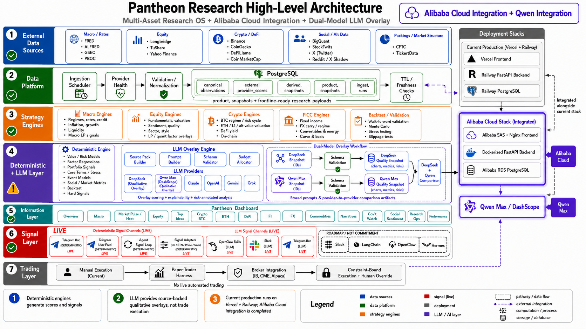

# Pantheon Research — Qwen Cloud Hackathon

> Dual-LLM equity qualitative overlay: **Qwen via Alibaba Cloud Model Studio / DashScope** vs **DeepSeek** — side-by-side comparison with agreement scoring, fail-closed LLM handling, evidence provenance, and a human-review gate.

A sanitized, judge-facing vertical slice of the private Pantheon Research production system — cloud deployment, data governance, dual-model comparison, and product-grade UI. **Not an API wrapper.**

> **Judges:** start with [docs/judge_evidence.md](docs/judge_evidence.md) for a **3-minute verification path** covering Alibaba ECS, DashScope/Qwen, RDS selected mirror, fail-closed model handling, and reproducible local smoke tests.

---

## Submission Links

| | |
|---|---|
| 🌐 Live Product | https://pantheon-research.com |
| ☁️ Alibaba Cloud Deployment | http://8.222.191.152 |
| 🎬 Demo Video | https://www.youtube.com/watch?v=68lceOACLKo |
| 🖼️ Deck | [Google Slides](https://docs.google.com/presentation/d/1E72ORBmaiL2QPbmL1CPBqrbSLLOsAVEnDxdo76IPJqs/edit?usp=sharing) |
| 💻 Public Code | https://github.com/0xjacobzhao-byte/pantheon-research-qwen-hackathon |

> The **live product** and **Alibaba deployment** run the full private production system. **This repository** is the sanitized, self-contained slice judges can clone and run in minutes.

---

## Quick Start

```bash
git clone https://github.com/0xjacobzhao-byte/pantheon-research-qwen-hackathon
cd pantheon-research-qwen-hackathon
docker compose up --build          # frontend :5173 · backend :8000
./scripts/judge_smoke.sh           # end-to-end smoke test (offline, no secrets)
```

<details>
<summary><b>Manual setup (no Docker)</b></summary>

**Backend** (Python 3.11–3.12):
```bash
cd backend && python -m venv .venv && source .venv/bin/activate
pip install -r requirements.txt
uvicorn main:app --reload --port 8000
```

**Frontend** (Node.js 18+):
```bash
cd frontend && npm install && npm run dev
```

| Service | URL |
|---------|-----|
| Frontend | http://localhost:5173 |
| Backend API | http://localhost:8000 |
| API Docs (Swagger) | http://localhost:8000/docs |

</details>

**Verify live Alibaba deployment:**
```bash
curl -s http://8.222.191.152/api/proof/alibaba-cloud | jq
```

---

## Architecture



Pantheon Research is a **framework-first, data-governed, human-in-the-loop AI research operating system**. This repository showcases the dual-LLM qualitative overlay feature: for a given stock ticker, two independent LLM providers (Qwen and DeepSeek) each produce a structured qualitative assessment, and the system compares them side-by-side.

```
Strategy ──▶ Information ──▶ Signal ──▶ Trading
```

| Layer | Role |
|-------|------|
| **Strategy** | Investment thesis and universe selection |
| **Information** | Evidence pack: quantitative metrics, fundamentals, market data |
| **Signal** | Dual-LLM qualitative overlay generates structured assessment fields |
| **Trading** | Human-in-the-loop decision gate (LLMs never execute trades) |

**Safety:** LLMs do not execute trades. Every signal passes a human-review gate. Pantheon Research is not an autonomous trading bot.

---

## Why This Is Not Just an LLM Wrapper

| Capability | Implementation |
|------------|---------------|
| **Fail-closed model states** — missing key → `BLOCKED_BY_MISSING_CREDENTIAL`, bad JSON → `PARSE_ERROR`, missing sample → `QWEN_NOT_GENERATED` | [`qwen_overlay.py`](backend/app/qwen_overlay.py) · [`models.py`](backend/app/models.py) |
| **Evidence hashing** — every pack committed to a `sha256` content hash threaded into each comparison | [`evidence_pack.py`](backend/app/evidence_pack.py) |
| **Dual-model agreement & divergence** — two independent models, per-field divergence, `data_state` (`LIVE_DUAL` / `OFFLINE_SAMPLE` / `MIXED` / `PARTIAL` / `BLOCKED`) | [`comparison.py`](backend/app/comparison.py) |
| **Human-review gate** — low agreement or major divergence flags `human_review_required`; fail-closed yields `NOT_COMPARABLE` | [`comparison.py`](backend/app/comparison.py) · [`OverlayComparisonPanel.tsx`](frontend/src/components/equity/OverlayComparisonPanel.tsx) |
| **Multi-asset scope** — Macro · TA · FICC (FI/FX/Commodity) · Equity module grid with per-module `data_state` | [`sample_modules.py`](backend/app/sample_modules.py) · [`ModuleSnapshotGrid.tsx`](frontend/src/components/ModuleSnapshotGrid.tsx) |
| **Research-Ops panel** — governance snapshot: provider config, coverage, per-ticker state | [`data_quality.py`](backend/app/data_quality.py) · [`DataQualityPanel.tsx`](frontend/src/components/DataQualityPanel.tsx) |
| **Validation methodology** — overlay is a tracked signal, not an alpha oracle | [docs/validation_methodology.md](docs/validation_methodology.md) |
| **Alibaba live deployment proof** — host-honest proof endpoint + admin-gated live Qwen smoke | [docs/live_proof.md](docs/live_proof.md) |

---

## Alibaba Cloud Integration

| Component | Detail |
|-----------|--------|
| Cloud Provider | Alibaba Cloud |
| AI Provider (Qwen) | Alibaba Cloud DashScope / Model Studio |
| Compute | Dockerized FastAPI behind Nginx on **Alibaba Cloud ECS** |
| Host Detection | Honest via `alibaba_hosted` (same image runs on Railway and Alibaba ECS) |
| Database | Alibaba RDS PostgreSQL-compatible — **selected evidence mirror** |

### Deployment Proof (secret-free)

The [`/api/proof/alibaba-cloud`](http://8.222.191.152/api/proof/alibaba-cloud) endpoint returns deployment metadata with **booleans only** — no keys, tokens, or connection strings. It makes **no external calls**, so it never claims connectivity it did not verify.

| Proof File | Purpose |
|------------|---------|
| [`backend/app/alibaba_cloud_proof.py`](backend/app/alibaba_cloud_proof.py) | Host/runtime, credential state, ECS/RDS/DashScope service map, safe/non-claims |
| [`backend/app/qwen_overlay.py`](backend/app/qwen_overlay.py) | Actual Qwen / DashScope API call implementation |

### Database Claim (precise — no overclaiming)

RDS **provisioning** is kept distinct from full production-data **migration**:

```json
{
  "role": "selected evidence mirror",
  "mirror_state": "partial_selected_mirror",
  "connected": null,
  "production_data_migrated": false,
  "full_production_clone_verified": false
}
```

On the **live ECS box**, RDS is deployed and connected (`connected: true`). This offline demo performs no probe (`connected: null`). Full production-data migration is **not claimed** without core row counts and API read-path verification. See [docs/live_proof.md](docs/live_proof.md) for the captured live response and [docs/alibaba_deployment_parity.md](docs/alibaba_deployment_parity.md) for the full breakdown.

---

## Qwen Integration

| Property | Value |
|----------|-------|
| Provider | Alibaba Cloud Model Studio / DashScope |
| Base URL | `https://dashscope-intl.aliyuncs.com/compatible-mode/v1` |
| Model | `qwen-plus` (configurable via `QWEN_MODEL`) |
| Auth | Bearer token (`DASHSCOPE_API_KEY`) |
| Protocol | OpenAI-compatible chat completions |

**Default mode is offline** — no API key required. Bundled sample data in `data/`. Set `DEMO_MODE=live` + `DASHSCOPE_API_KEY` for live calls. See [docs/qwen_integration.md](docs/qwen_integration.md).

### Production Coverage

| Metric | Value |
|--------|-------|
| Qwen comparison-capable | **312 tickers** |
| Markets | US 117 / CN 69 / HK 103 / SG 23 |
| Healthy comparisons | **312 / 312** |
| DeepSeek baseline universe | 1,331 |

---

## Demo Flow

1. **Select Ticker** — Choose MA (Mastercard) or NVDA (NVIDIA)
2. **Load Evidence** — Backend loads quantitative metrics from `data/`
3. **Qwen Overlay** — DashScope generates structured assessment
4. **DeepSeek Overlay** — DeepSeek generates independent assessment
5. **Comparison** — Agreement score, tone classification, divergences, evidence gaps
6. **Human Review Gate** — Low agreement or major divergences → human review flagged

Each overlay produces structured fields: `business_quality`, `moat`, `pricing_power`, `capital_allocation`, `red_flags`, `confidence` (0–1), `missing_evidence`.

<details>
<summary><b>Example comparison output (NVDA, offline sample)</b></summary>

```json
{
  "ticker": "NVDA",
  "data_state": "OFFLINE_SAMPLE",
  "agreement_score": 0.44,
  "agreement_level": "LOW",
  "qwen_tone": "conservative_positive",
  "deepseek_tone": "conservative_positive",
  "divergences": [{ "field": "pricing_power", "severity": "major" }],
  "evidence_gaps": ["No competitive ASIC roadmap analysis"],
  "human_review_required": true,
  "human_review_reason": "Low agreement between providers."
}
```

`data_state` is the honest headline: `LIVE_DUAL`, `OFFLINE_SAMPLE`, `MIXED`, `PARTIAL`, or `BLOCKED`. When a provider fails closed, the comparison is `NOT_COMPARABLE` — **no agreement score is fabricated**.

</details>

---

## API Endpoints

<details>
<summary><b>Full endpoint reference (21 endpoints)</b></summary>

| Method | Path | Description |
|--------|------|-------------|
| GET | `/` | Root info |
| GET | `/health` | Health check |
| **Core** | | |
| GET | `/api/project` | Project metadata |
| GET | `/api/evidence/{ticker}` | Evidence pack + provenance (sha256 content hash) |
| GET | `/api/overlay/qwen/{ticker}` | Qwen qualitative overlay |
| GET | `/api/overlay/deepseek/{ticker}` | DeepSeek qualitative overlay |
| GET | `/api/comparison/{ticker}` | Full dual-provider comparison |
| GET | `/api/data-quality` | Research-Ops / governance snapshot |
| GET | `/api/modules` | Module snapshot grid |
| GET | `/api/validation` | Forward-validation methodology |
| GET | `/api/demo-flow` | Demo flow steps |
| **Alibaba Proof** | | |
| GET | `/api/proof/alibaba-cloud` | Deployment proof (v2, canonical) |
| GET | `/api/alibaba/proof` | Deployment proof (alias) |
| GET | `/api/alibaba/qwen-config` | Qwen / DashScope configuration |
| **Production-Feel Panels** | | |
| GET | `/api/ticker-profile/{ticker}` | Ticker profile with KPI cards |
| GET | `/api/ticker-profiles` | List available ticker profiles |
| GET | `/api/provider-health` | Provider health snapshot |
| GET | `/api/validation-timeline` | Signal lifecycle timeline |
| GET | `/api/mini/macro` | Macro regime mini panel (context-only) |
| GET | `/api/mini/market-pulse` | Market Pulse / TA mini panel (context-only) |
| GET | `/api/mini/ficc` | FICC mini panel (context-only) |

</details>

---

## Tests

```bash
cd backend && python -m pytest            # 80 backend tests
cd frontend && npm test -- --run           # 9 frontend tests
cd frontend && npm run build               # production build
docker compose config                      # validate compose file
./scripts/judge_smoke.sh                   # end-to-end smoke
```

---

## Key Files Reference

| Category | File |
|----------|------|
| **Judge Evidence** | [`docs/judge_evidence.md`](docs/judge_evidence.md) |
| **Proof Bundle** | [`data/judge_proof_bundle.json`](data/judge_proof_bundle.json) |
| **Alibaba Proof Code** | [`backend/app/alibaba_cloud_proof.py`](backend/app/alibaba_cloud_proof.py) |
| **Qwen API Call** | [`backend/app/qwen_overlay.py`](backend/app/qwen_overlay.py) |
| Comparison Engine | [`backend/app/comparison.py`](backend/app/comparison.py) |
| Evidence Pack + Hash | [`backend/app/evidence_pack.py`](backend/app/evidence_pack.py) |
| Product UI | [`frontend/src/components/equity/OverlayComparisonPanel.tsx`](frontend/src/components/equity/OverlayComparisonPanel.tsx) |
| Data Quality Panel | [`backend/app/data_quality.py`](backend/app/data_quality.py) · [`DataQualityPanel.tsx`](frontend/src/components/DataQualityPanel.tsx) |
| Module Grid | [`backend/app/sample_modules.py`](backend/app/sample_modules.py) · [docs/module_snapshots.md](docs/module_snapshots.md) |
| Ticker Profile (KPIs) | [`backend/app/ticker_profile.py`](backend/app/ticker_profile.py) · [`TickerProfilePanel.tsx`](frontend/src/components/TickerProfilePanel.tsx) |
| Provider Health | [`backend/app/provider_health.py`](backend/app/provider_health.py) · [`ProviderHealthPanel.tsx`](frontend/src/components/ProviderHealthPanel.tsx) |
| Validation Timeline | [`backend/app/validation_timeline.py`](backend/app/validation_timeline.py) · [`ValidationTimeline.tsx`](frontend/src/components/ValidationTimeline.tsx) |
| Mini Panels (Macro/TA/FICC) | [`backend/app/mini_panels.py`](backend/app/mini_panels.py) |
| Multilingual Workflow | [docs/multilingual_research_workflow.md](docs/multilingual_research_workflow.md) |
| Live Proof Docs | [docs/live_proof.md](docs/live_proof.md) |
| Safe Claims & Non-Claims | [docs/safe_claims.md](docs/safe_claims.md) |
| Production Mapping | [docs/production_architecture_mapping.md](docs/production_architecture_mapping.md) |
| Judge Walkthrough | [docs/judge_walkthrough.md](docs/judge_walkthrough.md) |

---

## Tech Stack

| Layer | Technology |
|-------|-----------|
| Backend | FastAPI · Python 3.11–3.12 |
| Frontend | React 18 · TypeScript · Vite 6 |
| LLM (Qwen) | Alibaba Cloud DashScope (OpenAI-compatible) |
| LLM (DeepSeek) | DeepSeek API (OpenAI-compatible) |
| Database | PostgreSQL (Alibaba RDS-compatible) — production only |
| Deploy | Docker Compose · Alibaba ECS (Nginx → FastAPI) |
| Tests | pytest (backend) · vitest + Testing Library (frontend) |

---

## Scope & License

This repository is a **sanitized public hackathon demo** of Pantheon Research. The complete production codebase lives in the [private repository](https://github.com/0xjacobzhao-byte/Pantheon-Research) (closed-source to protect proprietary trading-strategy IP, provider integrations, and production data infrastructure). Qwen Hackathon judges may request temporary private access from Jacob Zhao.

No API keys, private user data, live trading credentials, production secrets, or private financial records are included.

**Author:** Jacob Zhao — [0xjacobzhao-byte](https://github.com/0xjacobzhao-byte)

**License:** Apache-2.0 — see [LICENSE](LICENSE).
