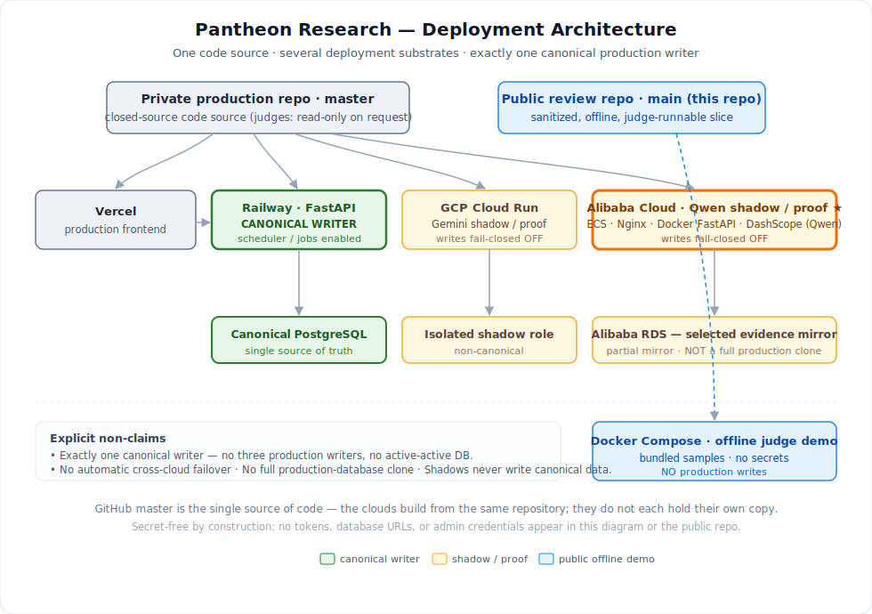
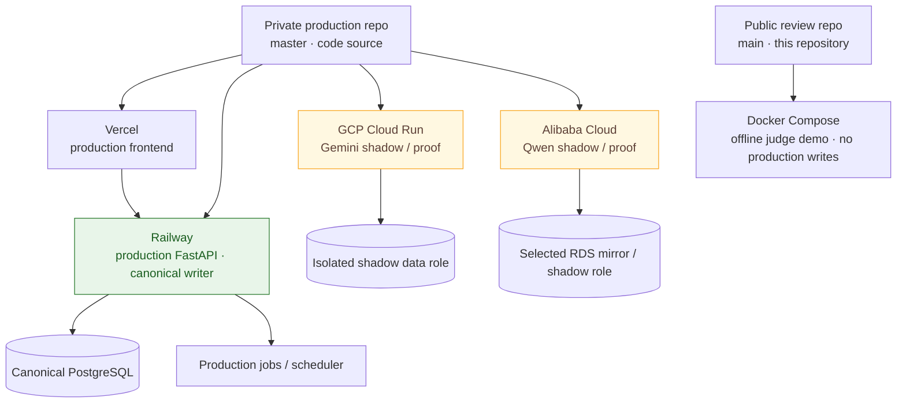

# Deployment Architecture

Pantheon runs on **one code source, several deployment substrates, and exactly
one canonical production writer.** This document describes the deployment model,
environment roles, write/scheduler safety, the Qwen/DashScope proof, and the
explicit non-claims. It contains **no secret values** — credential state is
referenced as booleans only.

## Code source and deployment roles

- The **private production repository** (`0xjacobzhao-byte/Pantheon-Research`,
  branch `master`) is the single source of code for the production deployments.
  It is closed-source; judges may request temporary read-only access.
- **This public repository** (`main`) is a sanitized, offline, judge-runnable
  slice. It is **not** a production deployment and writes to **no** production
  database — it runs via Docker Compose against bundled/local data.

## Environments and roles

| Environment | Role | Runtime | Data role | Writes / scheduler |
|---|---|---|---|---|
| **Vercel** | Production frontend | `pantheon-research.com` | — | — |
| **Railway** | Production backend / **canonical writer** | FastAPI + jobs | Canonical PostgreSQL | **Enabled** |
| **GCP Cloud Run** | Gemini shadow / proof | Scale-to-zero container | Isolated shadow role | Fail-closed OFF |
| **Alibaba Cloud** | **Qwen shadow / proof** | ECS + Nginx + Dockerized FastAPI | Selected RDS mirror | Fail-closed OFF |
| **Public judge demo** | Offline review slice (this repo) | Docker Compose | Bundled / local data | No production writes |

## Deployment model (not secret configuration)

- **Vercel and Railway** deploy from the production repository's native
  git-driven pipeline; the primary product path is automatic on eligible
  `master` merges. Documentation-only changes are intended to skip application
  redeploys where the pipeline supports it.
- **GCP and Alibaba** are deliberate, controlled deployments (manual /
  clean-worktree Docker rebuilds), not automatic followers of every commit.
- Multi-cloud deployment commands support a dry-run / preview mode before any
  substrate changes.

No secret environment values, tokens, or connection strings are exposed by any
of these flows in this public repository.

## Canonical writer and scheduler safety

- There is **exactly one canonical production writer** (Railway) to the
  production database.
- **Shadow deployments (GCP, Alibaba) do not mutate the canonical database.**
  Their write path and scheduler are **fail-closed OFF by role**, so a shadow
  cannot corrupt production state even while running the same image.
- Shadows use an **isolated data role** (GCP) or a **selected RDS mirror**
  (Alibaba) — never the canonical writer role.
- Missing or degraded inputs fail closed rather than writing a guessed value.

## Qwen / DashScope proof

- **Alibaba proves the Qwen / DashScope integration** on ECS (Nginx → Dockerized
  FastAPI) with a selected RDS evidence mirror. **GCP proves the Gemini path.**
  Each shadow runs the same logical overlay contract as the rest of the system,
  so a provider proof is a real integration, not a mock.
- The Alibaba deployment exposes a **secret-free** proof endpoint
  [`/api/proof/alibaba-cloud`](live_proof.md) that returns booleans only and
  makes no external calls.
- The actual Qwen call implementation is in
  [`backend/app/qwen_overlay.py`](../backend/app/qwen_overlay.py).

## Version observability and rollback

- Deployments expose **non-secret** version/health markers (commit SHA, runtime
  role) so an operator can confirm which build and which role (production writer
  vs. shadow) is serving. Credential state is reported as booleans only.
- Where applicable, database migration runs **before** application startup so a
  runtime never serves against an un-migrated schema.
- **Rollback** returns to the prior Vercel/Railway deployment for the production
  path; shadows roll back by image/revision. Because shadows are non-canonical,
  a shadow rollback cannot affect production data.

## Explicit non-claims

- **No three production writers** — exactly one canonical writer.
- **No active-active database** and **no automatic cross-cloud failover.**
- **No identical full production database clones.** The selected Alibaba RDS
  mirror is **not** canonical (`production_data_migrated = false`,
  `mirror_state = partial_selected_mirror`; see
  [`alibaba_deployment_parity.md`](alibaba_deployment_parity.md)).
- This public repository is the **offline judge demo**, not a production
  deployment.

> Some operational specifics (exact triggers, endpoints, scheduler
> configuration) live in the private production repository and are described
> here as deployment *principles*. Nothing in this document asserts a verified
> public-repo mechanism that is not present on this repository's `main`.
